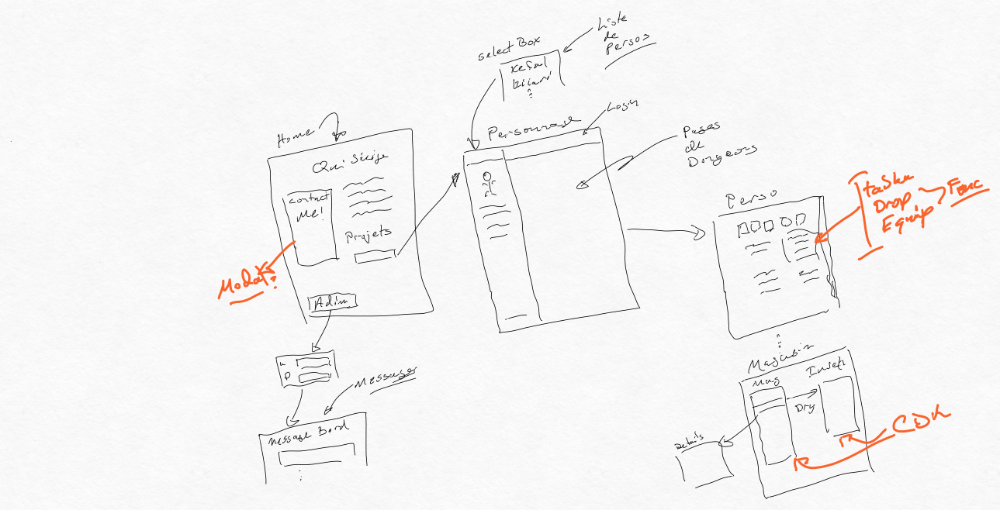

# 420-345-AL-22 Travail pratique #3

# Consignes du travail

* Le travail est à réaliser individuellement
* Ce travail compte pour 20 % de la note finale
* La date de remise est le lundi 12 décembre 2022 à 12:12
* Le travail doit être remis par commit dans le projet Github Classroom, aucune autre méthode de remise ne sera acceptée
* Tout retard dans la remise de ce travail entraînera une pénalité de 10% par jour de retard jusqu’à concurrence de 5 jours. Après cette date, la note zéro sera attribuée au travail.

# Livrable
Chaque étudiant devra livrer :
* Le code source du travail
* Contenue déployé sur la plateforme Firebase

# Exigences conceptuelles 
Pour ce TP vous allez ajouter des fonctionnalités sur votre application de personnage de donjons, mais aussi ajouter une vue permettant d'agir comme entrée de portfolio. Vous devrez donc organiser votre navigation permettant de personnaliser votre site a votre image et permettre un accès à l'application pour le personnage de donjons. 

Vous devrez donc compléter des fonctionnalités pour le personnage, mais aussi créer de nouvelles pages permettant de démontrer vos compétences

Une image est fournie au bas de cette page démontrant l'agencement des sections que vous devez créer. L'apparence de votre site vous est laissée libre, car le but est de faire une page qui vous représente. Cependant vous devrez avoir au minimum les informations spécifiées ici.

Dans ce travail vous allez démontrer votre savoir faire pour appliquer les notions apprises durant le cours pour avancer le projet de personnage de dongeon. Ici pour assurer une charge raisonable de travail il y aura des sections du site qui ne seront pas élaborer. Donc pour votre travail référez-vous à la section d'exigences fonctionnelles pour identifier le travail que vous aller devoir réaliser.

Ici pour ce travail vous aurez à récupérer dynamiquement les informations sur les personnages de dongons contenus dans le serveur. Votre page devra mettre en place un sélecteur permettant de voir les difféerents personnage existant. 

Vous devrez mettre un place une page de magasin permettant d'ajouter dans l'inventaire d'un personnage que vous possédé. Vous devrez assurer une gestion adéquate de l'inventaire pour votre personnage.

Vous aurez aussi à ajouter certaine fonctionalité tel un page de présentation pour votre site et une page permettant à une personne de mettre des commentaires sur votre page.

## Page initiale

Vous devez créer une page qui servira de page initiale pour votre site. Ici cette page ne sera pas liée au personnage de donjon. Elle devra permettre de vous présenter d'un point de vue professionnel.

Cette page devra permettre à une personne naviguant sur la page d'atteindre un formulaire permettant de vous laisser un message.

Aussi cette page doit contenir un lien ou un bouton permettant d'atteindre la vue pour le personnage de donjon.

## Fonction contact

Ici vous pouvez soit créer une nouvelle page ou bien faire une vue modale permettant de récupérer des messages provenant de personnes accédant votre site

## Interface pour voir vos messages

Créer une méthode permettant d'accéder à vos messages. NOTE: Ici pour accéder à vos messages l'utilisateur doit créer une session. Donc pour un visiteur de votre page, il ne devrait pas être possible d'atteindre la vue de message, car ils n'auront pas de compte. 

## Application Personnage de donjon

Tel de décrit dans le diagramme, vous devez changer votre navigation pour avoir votre personnage de donjon isolé derrière un lien ou un bouton. Cependant lorsque l'usager clique sur ce lien vous devrez présenter l'application pour le personnage de donjon. Mettre dans le haut de l'écran une icône de maison permettant de retourner votre utilisateur vers votre page personnelle.

Ici vous devrez rendre votre page entièrement dynamique en implémentant un ou des services permettant de récupérer les informations sur le personnage de donjon à afficher. Vous aussi aurez à créer une nouvelle page pour un magasin virtuel qui vous permet d'ajouter des articles à l'inventaire de votre personnage.

### Navigation

La partie de votre site qui affiche le nom du personnage de donjon doit être remplacée comme étant un `select` permettant de lister les personnages disponibles sur le serveur et de les voir sur votre site.

**Note: Par défaut vous devez afficher le personnage ID `demochar`**

Vous devez permettre à l'usager d'ouvrir une session pour être en mesure de modifier un personnage qui possède.

### Dés

Les dés doivent être sauvegardés dans un service ainsi si l'usager changes la vue ou de page et revient par la suite à la vue du composant dés. Il devrait pouvoir retrouver le dernier jet de dés.

### Personnage

Tous les éléments du personnage doivent être fonctionnels et récupérés dynamiquement sur les serveurs correspondants. Vous devez récupérer les informations sur les personnages sur le serveur `cegep.fdtt.space` tel que vu en classe. Pour les détails sur les sorts, inventaires et traits, vous devrez récupérer les informations du serveur. `https://www.dnd5eapi.co/`

#### Tableau d'inventaire

L'option drop du tableau d'inventaire doit être disponible uniquement si l'utilisateur a les droits. Choisir cette option devrait éliminer l'objet de l'inventaire.

La fonction équipée devrait fonctionner uniquement pour les armes et mettre l'objet à l'état équipé.

#### Journal

Vous pouvez éliminer cette section.

### Magasin

Vous devez créer une nouvelle page permettant d'ajouter des articles dans l'inventaire de votre personnage. Pour créer cette page, vous devez utiliser les fonctionnalités "Drag and Drop" de la librairie CDK.

Vous devez implémenter un mécanisme de prévisualisation permettant de voir les détails de l'article.

## Déploiement

Vous devez déployer votre projet en utilisant les services de Firebase. Vous devez créer un fichier rapport.md indiquant ou trouver votre projet déployé dans Firebase.

# Exigences fonctionnelles

Ici, quelques exigences que vous devez considérer:

## Mode vue seulement

Le serveur ne vous permet que de modifier vos propres personnages. Donc lorsque vous affichez un personnage dont vous n'êtes pas propriétaire vous ne devez pas afficher des fonctionnalités invitant votre usager à faire des modifications. Par exemple. les boutons `-` et `+` pour changer les points de vie devrait être soit non présent ou non actif permettant à votre utiliser de savoir qu'il ne peut pas interagir avec votre personnage.

Si l'usager possède une session et a les droits de modification du personnage alors ces options devraient être disponibles.

## Page de contact

La page de contact doit être la racine de votre site. Elle doit vous représenter. 

# Distribution des points:

TBD

# Mockup haut niveau

